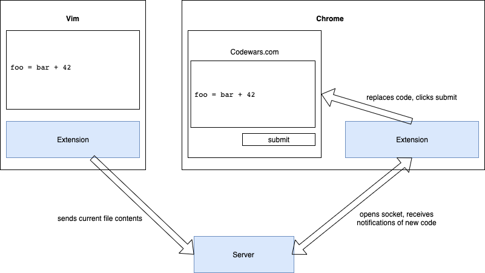
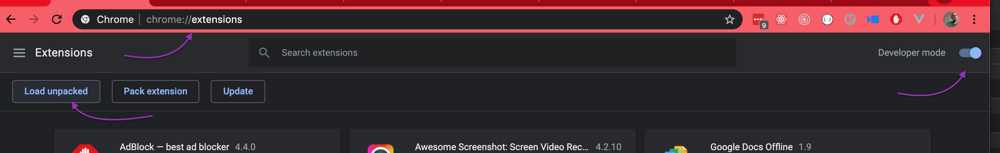

# Codewars

This allows you to work in Vim and submit your code to the Codewars.com page.





The three elements in this lovely diagram are provided.

## Vim Extension (aka client)

**Installation**

```sh
mkdir -p ~/.vim/plugin
ln -s (pwd)/client/jex-sendfiletoserver.vim ~/.vim/plugin/jex-sendfiletoserver.vim
```

**Usage**

Add a key-binding to your `.vimrc`.

```vim
" SendContents - calls extension that sends current contents to server
:nmap <leader>sc :JCW<cr>
```

When you're ready, `<leader>sc` will send the current file to the server.


## Server

**Installation**

```sh
cd server
npm i
```

**Usage**

```sh
# from project root
node server
```

## Chrome Extension

**Installation**

In Chrome, open chrome://extensions.

Turn on "Developer mode."

"Load unpacked"



Select `extension/`


**Usage**

Anytime you are on codewars.com, the extension will automatically open a socket
with the server.  When the server sends it new code, the extension will put it
in the code editor on the web page and submit the tests.
